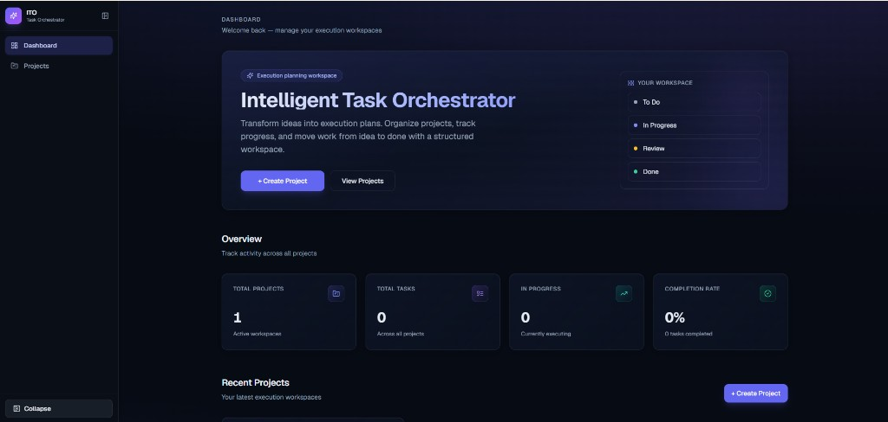
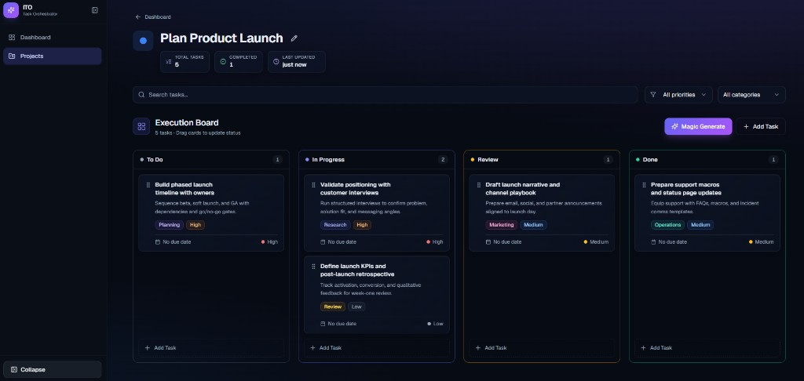

# Intelligent Task Orchestrator

**Transform ideas into execution plans.**

Intelligent Task Orchestrator is a client-first execution planning workspace for product teams and solo builders. Capture a project idea, break it into actionable work on a Kanban board, and accelerate planning with AI-generated subtasks—all in a responsive dark SaaS interface with zero backend dependency for core workflows.

---

## Live demo

| Environment | URL |
|-------------|-----|
| **Production (Vercel)** | `https://your-deployment.vercel.app` — *replace after deploy* |
| **Local** | [http://localhost:3000](http://localhost:3000) |

> **Submission note:** Deploy to [Vercel](https://vercel.com) (or Netlify), then paste your public URL above before hand-in.

---

## Screenshots

| Dashboard | Project board |
|-----------|---------------|
|  |  |

*Add captures under `docs/screenshots/` (dashboard, project workspace, Magic Generate, mobile layout). Until then, run locally with `npm run dev:fresh`.*

---

## Product overview

The app mirrors how modern teams move from intent to execution: define a **project**, generate or author **tasks**, organize work across **To Do → In Progress → Review → Done**, and persist everything in the browser. Magic Generate turns a project title into five domain-aware subtasks (e.g. deployment, QA, docs) without leaving the board. Drag-and-drop reordering and column moves stay smooth thanks to **dnd-kit**, while **localStorage** keeps data across sessions without a database.

---

## Features

| Capability | Description |
|------------|-------------|
| **Project CRUD** | Create, edit, and delete projects from the dashboard and projects list with confirmation dialogs |
| **Task CRUD** | Full task model: title, description, category, priority, status, due date; edit/delete with confirmation |
| **Kanban board** | Four-column workflow with counts, empty states, and column-level drop targets |
| **dnd-kit drag-and-drop** | Reorder within columns and move across columns; drag handle isolated from card actions |
| **AI Magic Generate** | Five categorized subtasks from project context; skeletons, success/error toasts, retry on failure |
| **localStorage persistence** | Hydration-safe store; automatic save after client load |
| **Responsive dark SaaS UI** | Glass cards, indigo accents, hover micro-interactions; 4 / 2 / 1 column Kanban breakpoints |
| **Graceful error handling** | Route-level `error.tsx` / `global-error.tsx`, dev chunk recovery, non-blocking AI failures |

---

## Tech stack

| Layer | Choice |
|-------|--------|
| Framework | [Next.js 15](https://nextjs.org) (App Router, React 19) |
| Language | [TypeScript](https://www.typescriptlang.org) |
| Styling | [Tailwind CSS](https://tailwindcss.com) v3 + custom design tokens |
| UI primitives | [shadcn/ui](https://ui.shadcn.com) (Radix UI) |
| Drag and drop | [@dnd-kit](https://dndkit.com) (core, sortable, utilities) |
| Icons | [Lucide React](https://lucide.dev) |
| Persistence | Browser `localStorage` (`ito-app-state-v1`) |
| AI (optional) | Next.js Route Handler + template/heuristic plan generation |

---

## Local setup

### Prerequisites

- **Node.js** 18.17 or later  
- **npm** 9 or later  

### Install and run

```bash
git clone <your-repo-url>
cd intelligent-task-orchestrator
npm install
npm run dev
```

Open [http://localhost:3000](http://localhost:3000).

If dev assets look unstyled or chunks fail after HMR, use a clean dev start:

```bash
npm run dev:fresh
```

### Production build

```bash
npm run build
npm start
```

### Environment variables

No variables are required for localStorage-only mode. For extended AI providers, configure secrets in `.env.local` per your deployment (see `src/app/api/ai/generate-plan/route.ts`).

---

## Architecture overview

```
┌─────────────────────────────────────────────────────────────────┐
│                     Next.js App Router (RSC + client)            │
├──────────────┬──────────────────────┬───────────────────────────┤
│  Dashboard   │  Projects list       │  Project workspace [id]   │
│  page.tsx    │  projects/page.tsx   │  projects/[id]/page.tsx   │
└──────┬───────┴──────────┬───────────┴─────────────┬─────────────┘
       │                  │                         │
       ▼                  ▼                         ▼
┌──────────────────────────────────────────────────────────────────┐
│ AppProvider → useAppStore (Context)                               │
│   • useLayoutEffect hydrate from localStorage                     │
│   • useEffect persist on state change                             │
│   • CRUD: projects, tasks, moveTask (Kanban order + status)       │
└───────────────────────────────┬──────────────────────────────────┘
                                │
       ┌────────────────────────┼────────────────────────┐
       ▼                        ▼                        ▼
┌─────────────┐        ┌───────────────┐       ┌─────────────────┐
│  services/  │        │  components/  │       │  hooks/         │
│  storage    │        │  kanban, tasks│       │  use-task-crud  │
│  projects   │        │  ai, layout   │       │  use-magic-gen  │
│  tasks, ai  │        │  dashboard    │       │  use-toast      │
└─────────────┘        └───────────────┘       └─────────────────┘
                                │
                                ▼
                    ┌───────────────────────┐
                    │  POST /api/ai/        │
                    │  generate-plan        │
                    └───────────────────────┘
```

### Directory layout

```
src/
├── app/                      # Routes, globals, API, error boundaries
│   ├── page.tsx              # Dashboard
│   ├── projects/             # List + [id] workspace
│   └── api/ai/generate-plan/ # Magic Generate endpoint
├── components/
│   ├── ai/                   # Magic Generate UI
│   ├── dashboard/            # Hero, stats, project cards
│   ├── kanban/               # Board, columns, DnD context
│   ├── layout/               # App shell, sidebar, toaster
│   ├── projects/             # Project CRUD modals & cards
│   ├── tasks/                # Task cards, forms, delete dialog
│   ├── providers/            # AppProvider
│   └── ui/                   # shadcn primitives
├── hooks/                    # Store, CRUD, Magic Generate, toast
├── lib/                      # Utils, badges, metrics, dev recovery
├── services/                 # Storage, entities, AI plan templates
└── types/                    # Project, Task, AppState
```

Data flows **unidirectionally**: UI events → hooks/store → pure service helpers → React state → `saveState()`. Kanban moves call `moveTask` to reindex orders per column without dropping tasks from state.

---

## Design decisions

1. **Client-only persistence** — Eliminates auth and hosting complexity for assessment scope; `hydrated` gating prevents SSR/localStorage mismatch.
2. **Feature folders** — Components grouped by domain (kanban, tasks, ai) so prompts and PRs stay scoped.
3. **Column droppables + sortable cards** — Empty columns accept drops; task cards use a dedicated drag handle so edit/delete never conflict with DnD.
4. **Magic Generate as additive** — AI inserts into **To Do** only; manual CRUD and drag order remain source of truth.
5. **Premium dark system** — CSS variables + `glass-card` utilities; responsive Kanban via `kanban-grid` (1 / 2 / 4 columns).
6. **Fail-soft AI** — Errors surface as toasts with retry; board and localStorage stay consistent.
7. **Descriptive Git history** — Small, conventional commits (`feat:`, `fix:`, `refactor:`, `docs:`) for reviewability (see [AI_WORKFLOW.md](./AI_WORKFLOW.md#5-git-workflow--commit-history)).

---

## Deployment (Vercel)

1. Push the repository to GitHub (or GitLab/Bitbucket).
2. Import the project at [vercel.com/new](https://vercel.com/new).
3. Framework preset: **Next.js** (defaults are sufficient).
4. Build command: `npm run build` · Output: `.next` (automatic).
5. Deploy. Copy the production URL into the **Live demo** section above.

```bash
# Optional CLI deploy
npm i -g vercel
vercel login
vercel --prod
```

**Netlify:** Use the Next.js runtime plugin or `next build && next start` with appropriate redirects; Vercel is the path of least resistance for App Router 15.

---

## Usage

1. Create a **project** from the dashboard or **Projects** page.
2. Open the **workspace** — search and filter tasks by priority/category.
3. Click **Magic Generate** to add five AI subtasks to **To Do** (or **Add Task** manually).
4. **Drag** tasks between columns or reorder within a column.
5. **Edit** or **delete** tasks via hover actions; confirm destructive deletes.
6. Refresh the browser — data reloads from **localStorage**.

---

## AI-assisted development

This repository was built with **Cursor Composer** and iterative AI pairing. For the original scaffold prompt, a documented Claude bug fix, efficiency estimates, and the recommended commit workflow, see:

**[AI_WORKFLOW.md](./AI_WORKFLOW.md)**

---

## Scripts

| Command | Purpose |
|---------|---------|
| `npm run dev` | Dev server (clears webpack cache via `dev-fresh.js`) |
| `npm run dev:fresh` | Wipe `.next` then start dev |
| `npm run build` | Production build + typecheck |
| `npm run start` | Serve production build |
| `npm run lint` | ESLint (Next.js config) |

---

## License

MIT
